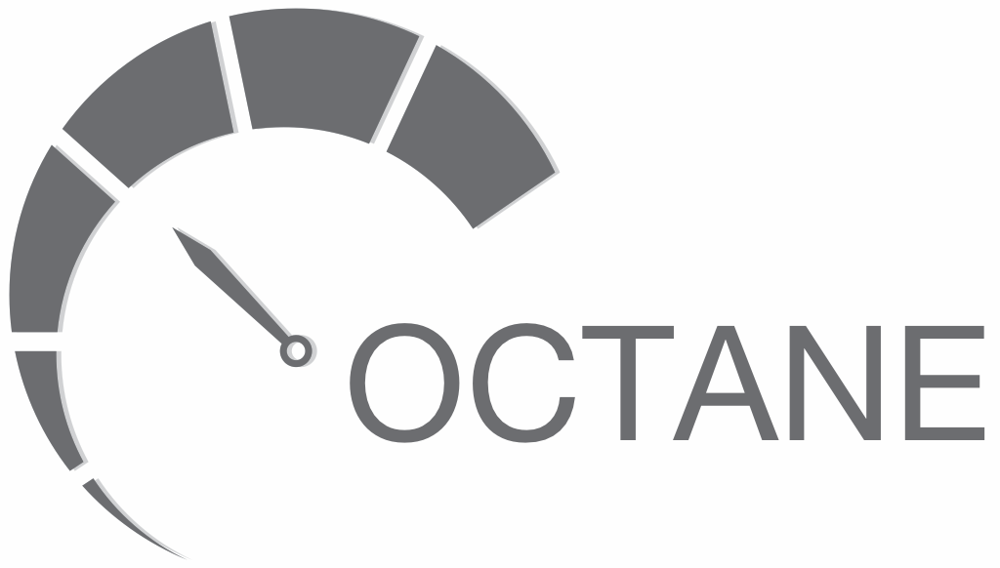

# Octane Overview
libuv is a cross-platform  asynchronous I/O library that only uses a single event loop thread for TCP traffic.

Octane is a high performance library that extends libuv to scale and use all the available CPU cores on a system for TCP traffic by using multiple event loops across multiple threads.

# Optimizations
- Prefers a thread count that matches physical CPU cores excluding hyper-threaded cores.
- TCP connections pinned to physical CPU cores for low context switching and high L1/L2/L3 cache hits.
- Zero-copy optimizations.
- High performance memory allocators.
  - A high performance lockless memory allocator is available for `Linux` to scale to higher CPU core counts to reduce CPU contention and stalls between CPU cores.

# Raw I/O Benchmarks
Benchmarking raw HTTP request/response throughput we can reach over `17 million requests/second`. Keep in mind this benchmark isn't parsing HTTP requests. 

```
./lib/wrk/wrk --script ./benchmark/pipelined.lua --latency -d 60s -t 20 -c 256 http://IP:80 -- 64
Running 1m test @ http://IP:80
  20 threads and 256 connections
  Thread Stats   Avg      Stdev     Max   +/- Stdev
    Latency     1.45ms    7.30ms 667.25ms   99.09%
    Req/Sec     0.91M   168.04k    2.40M    71.13%
  Latency Distribution
     50%    1.06ms
     75%    1.80ms
     90%    2.82ms
     99%    7.62ms
  1,086,106,192 requests in 1.01m, 128.46GB read
Requests/sec: 17,886,898.43
Transfer/sec:      2.12GB
```

# Supported Platforms
Platforms supported:
- Linux
- macOS

Windows could be supported pretty easily with a little work.

# Compiling
Compiling `octane` and a `hello_world` HTTP server example.
```
make
```

Compiling benchmarking tools.
```
make tools
```

# Memory Allocators
You can use `LD_PRELOAD` to use different memory allocators with octane.

TCMalloc
```
LD_PRELOAD="./lib/tcmalloc/.libs/libtcmalloc_minimal.so" ./build/hello_world
```

Lockless
```
LD_PRELOAD="./lib/lockless_allocator/libllalloc.so.1.3" ./build/hello_world
```